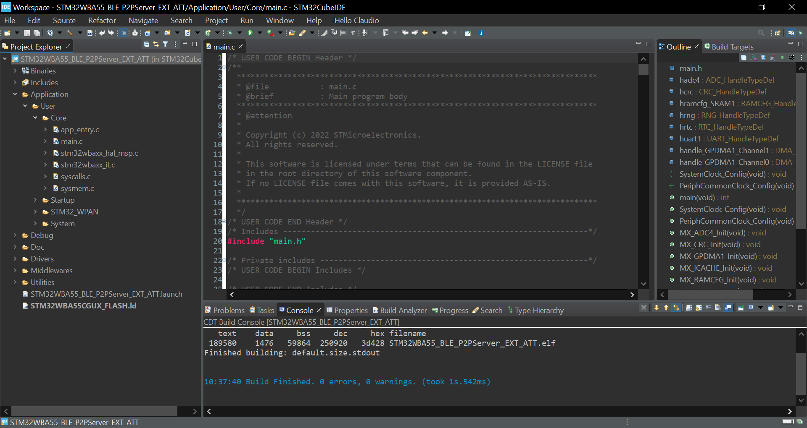

# STM32WBA55_BLE_P2PServer_EXT_ATT

* The STM32WBA55_BLE_P2PServer_EXT_ATT is based on the BLE_P2PServer application from CubeWBA V1.3.0.
* This application is an example of the following attribute functionality:
    * Sending Regular Notifications using ACI_GATT_UPDATE_CHAR_VALUE() to a BLE Client (Data Length < 250 Bytes)
    * Sending Extended Notifications using ACI_GATT_UPDATE_CHAR_VALUE_EXT() to a BLE Client (Data Length <= 509 Bytes)
    * Receiving Regular or Extended Writes from a BLE Client
    * Receiving Regular or Extended Read Requests from a BLE Client
* This application is setup to work out of the box with the STM32WBA55_BLE_P2PClient_EXT_ATT example. However, it may work with other BLE Clients as well.

## Hardware Needed

  * One or Two [NUCLEO-WBA55](https://www.st.com/en/evaluation-tools/nucleo-wba55cg.html)
    * One for STM32WBA55_BLE_P2PServer_EXT_ATT
    * One for STM32WBA55_BLE_P2PClient_EXT_ATT (Optional)

## Software Needed

  * Prebuilt firmware image: STM32WBA55_BLE_P2PServer_EXT_ATT.hex (STM32WBA55_BLE_P2PServer_EXT_ATT\Binary)

  * [STM32WBA55_BLE_P2PClient_EXT_ATT](https://github.com/stm32-hotspot/STM32WBA55_BLE_P2PClient_EXT_ATT) (Optional)

  * [STM32CubeProgrammer](https://www.st.com/en/development-tools/stm32cubeprog.html)

  * IDE (Optional)

    * [STM32CubeIDE](https://www.st.com/en/development-tools/stm32cubeide.html)

    * [IAR EWARM](https://www.iar.com/products/architectures/arm/iar-embedded-workbench-for-arm/)

    * [Keil MDK-ARM](https://developer.arm.com/Tools%20and%20Software/Keil%20MDK)

  * [Tera Term](https://teratermproject.github.io/index-en.html) (Optional)

## User's Guide

1) Flash the NUCLEO-WBA55 with the application using one of the following methods:

    a) Flash the prebuilt firmware image with STM32CubeProgrammer.

    

    b) Build and debug the application with an IDE.

    

2) View the debug log output using Tera Term, you may need to press the reset button to view the inital logs (optional).

3) Press SW1 on the STM32WBA55_BLE_P2PClient_EXT_ATT device to start scanning and automatic connection.

4) Press SW3 on the STM32WBA55_BLE_P2PServer_EXT_ATT device to perform an ATT MTU exchange procedure. This is necessary for peforming extended attribute functionality. 

5) Press SW1 on the STM32WBA55_BLE_P2PServer_EXT_ATT device to send a regular notification using ACI_GATT_UPDATE_CHAR_VALUE() to the STM32WBA55_BLE_P2PClient_EXT_ATT device.

6) Press SW2 on the STM32WBA55_BLE_P2PServer_EXT_ATT device to send a extended notification using ACI_GATT_UPDATE_CHAR_VALUE_EXT() to the STM32WBA55_BLE_P2PClient_EXT_ATT device.

7) Press SW1 on the STM32WBA55_BLE_P2PClient_EXT_ATT device to send a regular write using ACI_GATT_WRITE_WITHOUT_RESP() to the STM32WBA55_BLE_P2PServer_EXT_ATT device.

8) Press SW2 on the STM32WBA55_BLE_P2PClient_EXT_ATT device to send a extended write using ACI_ATT_PREPARE_WRITE_REQ() & ACI_ATT_EXECUTE_WRITE_REQ() to the STM32WBA55_BLE_P2PServer_EXT_ATT device.

9) Press SW3 on the STM32WBA55_BLE_P2PClient_EXT_ATT device to send a regular or extended read request using ACI_GATT_READ_CHAR_VALUE() to the STM32WBA55_BLE_P2PServer_EXT_ATT device.

## Troubleshooting

**Caution** : Issues and the pull-requests are **not supported** to submit problems or suggestions related to the software delivered in this repository. The STM32WBA55_BLE_P2PServer_EXT_ATT example is being delivered as-is, and not necessarily supported by ST.

**For any other question** related to the product, the hardware performance or characteristics, the tools, the environment, you can submit it to the **ST Community** on the STM32 MCUs related [page](https://community.st.com/s/topic/0TO0X000000BSqSWAW/stm32-mcus).